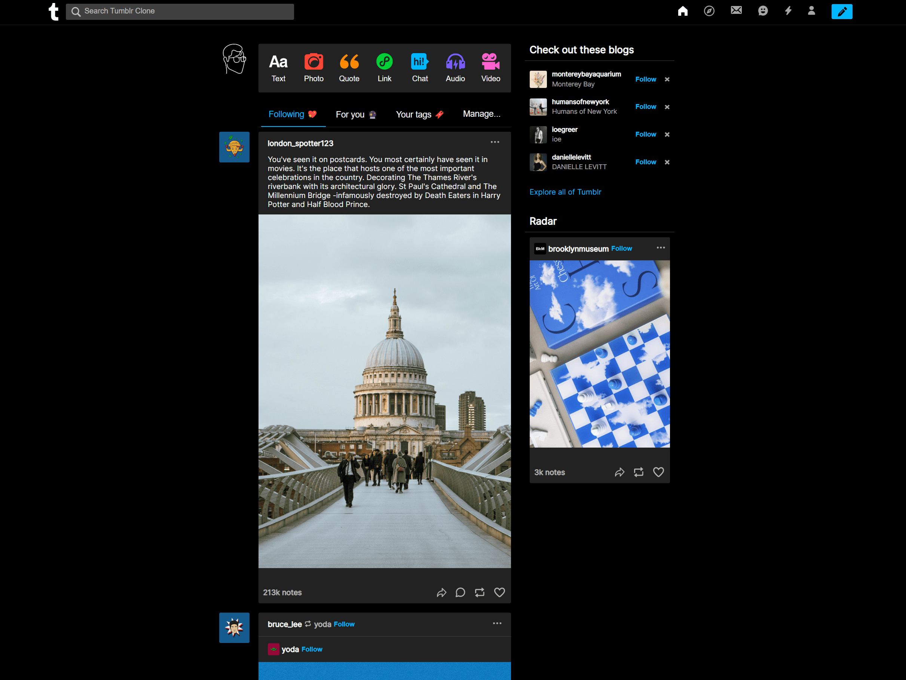
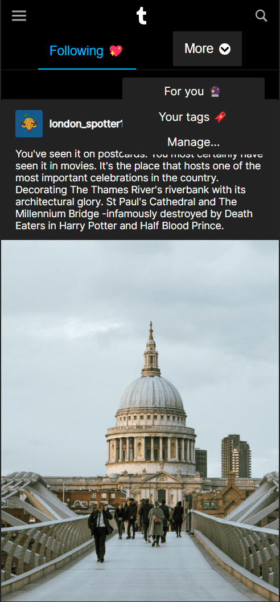
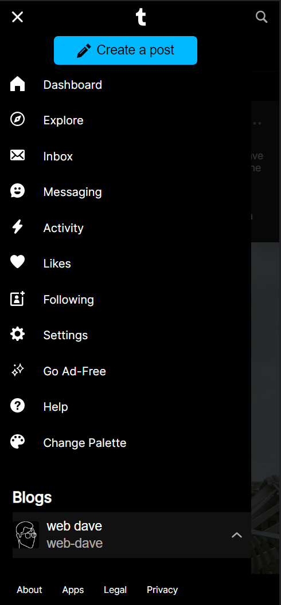

# Tumblr Clone
This project is a responsive HTML study of the Tumblr's main page. The objective was to recreate the layout as closely as possible. Being a fresh developer, it was the perfect opportunity to practice HTML and get familiar with Sass.

Technologies used:
* HTML
* Sass
* JavaScript - used to handle the functionality of the hamburger navigation in the mobile view

You can see the project live [here](https://fluffy-granita-e2b65a.netlify.app/).

## Desktop main page

## Mobile main page

## Mobile side navigation
 